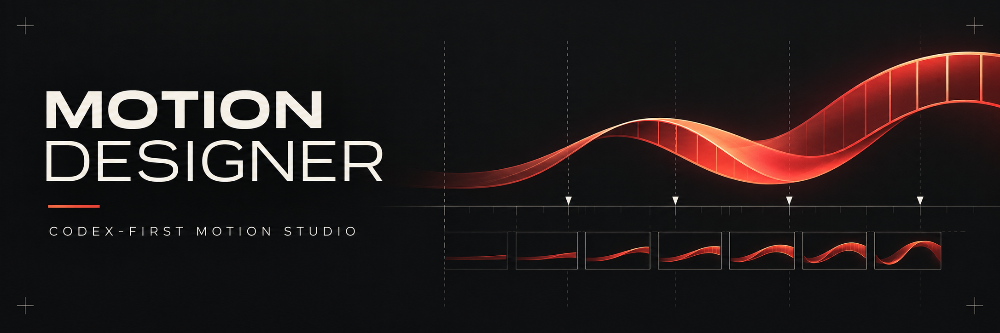

# Motion Designer v1.4 — Codex Edition



**Motion Designer** to plugin do Codeksa (Codex-first) — system produkcji motion AI-native.

`brief → inspekcja repo → Creative DNA → referencje → Style Lock → storyboard → patterny → router silników → build → preview → review/fix → eksport`

> 🇬🇧 English version: [`README.md`](README.md)

## Co nowego w v1.4
- Workflow runtime Codeksa zamiast trybu „tylko planowanie".
- Neutralny wobec silnika kontrakt `motion-project.json`.
- Osobny skill budowania z zasadami inspekcji repo i preview.
- Osobny skill audio/beat.
- Domyślne ustawienia wizualne studia oddzielone od ogólnych reguł silników.
- Schematy maszynowe i startowe profile stylu.
- Jasne kontrakty adapterów dla Remotion, HyperFrames, Motion Canvas, Three.js i FFmpeg.
- Ograniczona pętla review z konkretnymi patchami.

## Jak się tego używa

```text
/motion Zrób 15-sekundowy reel 9:16 z tego repo.
```

```text
/motion-style Daj mi trzy kierunki dla tego produktu. Premium, wizualnie pierwsze, bez generycznego AI-looku.
```

```text
/motion-build Zaimplementuj zatwierdzony storyboard na najlepszym lokalnym code-native stacku. Najpierw render niskiej jakości.
```

```text
/motion-review Sprawdź render i popraw blokujące problemy wizualne/timingowe.
```

## Zasada działania
Plugin nie wymaga jednego renderera. Źródłem prawdy jest Motion Project; silniki to adaptery.

## Struktura repozytorium

```text
plugin.json                     manifest pluginu
.codex-plugin/plugin.json       manifest interfejsu Codeksa
AGENTS.md                       zasady działania
skills/
  motion-director/              orkiestrator, schematy, domyślne ustawienia studia
  motion-style-engine/          profile stylu i biblioteka stylów
  reference-scout/              zbieranie referencji
  storyboard/                   autorstwo storyboardu z timingiem
  engine-router/                wybór renderera
  motion-build/                 przewodniki implementacji per silnik
  audio-design/                 projektowanie dźwięku i beatu
  motion-reviewer/              QA wizualne i pętla poprawek
```

## Model bezpieczeństwa
- Żadne klucze API, tokeny, ciasteczka, prywatne assety klientów ani dane osobowe nie są przechowywane w plikach śledzonych przez repo.
- Planowanie i prompty nie autoryzują płatnej generacji — koszt najpierw weryfikowany i zatwierdzany.
- Render, preview czy upload jest raportowany jako wykonany tylko wtedy, gdy komenda faktycznie się zakończyła.

## Licencja
MIT — patrz [`LICENSE`](LICENSE). Silniki i projekty zewnętrzne mają własne licencje: [`THIRD_PARTY_NOTICES.md`](THIRD_PARTY_NOTICES.md).

## Autor
Tabasco Creatives / AI Evolution Labs.
